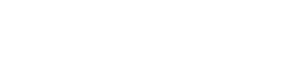

# Introduction

CLAWDIA is an open-source Python framework for applying sparse dictionary
learning (SDL) to gravitational-wave (GW) data analysis.

The framework systematises previously isolated SDL workflows into a unified,
modular environment with a consistent, NumPy-style API. The current release
focuses on time-domain denoising and classification under realistic detector
noise. Denoising is implemented through several LASSO-regularised sparse
reconstruction strategies (including simple sliding-window, margin-constrained,
iterative-residual, and reference-guided methods) built on top of the SPAMS
LASSO solver. Classification is provided by a dedicated dictionary model based
on Low-Rank Shared Dictionary Learning (LRSDL), tailored to fixed-length GW
signals. All dictionaries are exposed as Python classes that handle training,
reconstruction, and prediction, and can be used independently or combined in
custom workflows.

A lightweight classification pipeline is included as a reference implementation.
It chains together preprocessing (via GWADAMA), sparse denoising, and an LRSDL
classifier to perform supervised classification in low signal-to-noise ratio
conditions. The pipeline is not the architectural centre of the framework but a
convenient example of how individual components can be assembled into a
reproducible SDL-based workflow.

Beyond these specific methods, CLAWDIA is intended as a general-purpose,
community-driven library for sparse modelling in GW data analysis. Its design
targets scarce-data regimes, class imbalance, and interpretability, aiming to
provide robust, physically meaningful representations of GW morphology. The
framework is designed to remain extensible: future releases are planned to
include additional SDL-based classifiers, patch-based models for variable-length
signals, frequency- or band-targeted dictionaries, adaptive and multi-detector
setups, and support for further tasks such as detection, parameter estimation,
regression, and controlled data generation. Optimisation tools, curriculum-like
training schemes, and more efficient back-ends (including compiled extensions)
are also foreseen.

## [DOCUMENTATION](https://miquellluis.github.io/CLAWDIA/)

# Citation

Users of clawdia are kindly requested to cite the corresponding framework paper
when using the software in academic work:

    Miquel Llorens-Monteagudo, Alejandro Torres-Forné, and José A. Font.
    “CLAWDIA: A Dictionary Learning Framework for Gravitational-Wave Data Analysis.”
    Machine Learning: Science and Technology 7, no. 4 (2026): 045014. https://doi.org/10.1088/2632-2153/ae7e3a.

This paper should be taken as the primary reference for clawdia, and
provides further details together with illustrative applications to real and
simulated GW data.

CLAWDIA was developed as part of the PhD thesis:

    M. Llorens-Monteagudo, 2025,
    "Gravitational-wave signal denoising, reconstruction and classification via Sparse Dictionary Learning",
    PhD thesis, Universitat de València, Spain.
    Publicly available at https://hdl.handle.net/10550/110046
